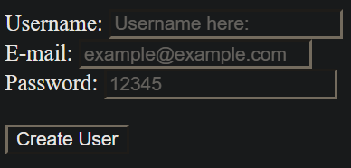

# Forms project

> In this project we created the model, controller and views for the create, edit and index part of our rails webpage using active records commands.

## Code execution view:



## Built With

- Ruby on Rails
- Active Records

## Getting Started

To get a local copy up and running follow these simple example steps:

- Clone this repository into your local machine.
- Access the New User creation view by typing this in your command line:

```bash
  $ rails server
```

- Enter in your web browser address bar:

    localhost:3000

### Validators

- Rubocop
- Stickler

## Authors

👤 **Elias Castañeda**

- Github: [@e71az](https://github.com/e71az)
- Linkedin: [@e71az](https://www.linkedin.com/in/e71az/)

👤 **Daniel Sokil**

- Github: [@danielsokil](https://github.com/danielsokil)
- Linkedin: [@danielsokil](www.linkedin.com/in/daniel-sokil)

## 🤝 Contributing

Contributions, issues and feature requests are welcome!

Feel free to check the [issues page](https://github.com/e71az/re-former/issues).

## Show your support

Give a ⭐️ if you like this project!


## 📝 License

This project is [MIT](lic.url) licensed.
